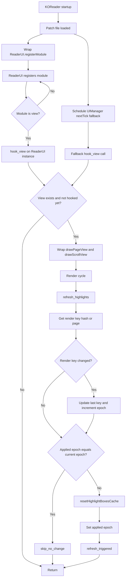

# KOReader Highlight Refresh Patch

## At a glance

This patch fixes delayed highlight correction after layout/render changes.

- Before: highlights can stay visibly misaligned, and in practice may take around 10-15 seconds to settle into the correct position.
- After: cache reset is triggered in the draw path as soon as render context changes are detected.

## User guide

### What this patch improves

- Highlights realign faster after reflow-related changes.
- Less time with stale highlight box positions.

### Installation

1. Place the patch file in `koreader/patches/` (for example `2-highlight-refresh.lua`).
2. Open KOReader Patch Manager.
3. Enable the patch.
4. Restart KOReader.

### Optional debug logs

- Set `PATCH_DEBUG = true` in the patch file.
- Logs are appended to `/tmp/patch.log`.
- Main markers:
  - `patch_load`
  - `inject_hooks`
  - `ui_ready`
  - `refresh_triggered`
  - `skip_no_change`

## Developer notes

### Hook strategy

- Wrap `ReaderUI.registerModule`.
- When module name is `view`, call `hook_view(self)`.
- Keep a fallback `UIManager:nextTick(...)` path: `hook_view(ReaderUI.instance or UIManager:getTopWidget())`.

### Wrapped methods

- `drawPageView`
- `drawScrollView`

Each wrapper calls `refresh_highlights(self)` before the original draw call.

### Core logic

- `get_render_key(ui)`:
  - Uses cached method refs from `hook_view`.
  - Tries `getDocumentRenderingHash(true)` first.
  - Falls back to `getCurrentPage(true)`.

- `refresh_highlights(view)`:
  - Reads render key and compares with `_last_render_hash`.
  - On change: increments `_hr_epoch`.
  - Skips when `_hr_applied_epoch == _hr_epoch`.
  - Otherwise calls cached `resetHighlightBoxesCache` and updates `_hr_applied_epoch`.

- `hook_view(ui)`:
  - Validates required objects/functions.
  - Caches function references on `ui`.
  - Installs wrappers once via `_highlight_refresh_hooked`.

### Runtime state

- `_last_render_hash`: last render key.
- `_hr_epoch`: generation counter for render-key changes.
- `_hr_applied_epoch`: last generation already refreshed.
- `_highlight_refresh_hooked`: prevents duplicate wrapping.

### Performance

- O(1) checks in render path.
- No text scanning or heavy processing.
- One cache reset per generation change.
- Cached function refs reduce hot-path lookup overhead.

## Execution flow

1. Patch file loads.
2. `ReaderUI.registerModule` is wrapped.
3. `nextTick` fallback hook is scheduled.
4. `view` module appears, `hook_view` installs wrappers.
5. Wrapped draw method runs `refresh_highlights`.
6. Render key is checked and epoch is updated if changed.
7. If current epoch is already applied, skip.
8. Else run `resetHighlightBoxesCache` and mark epoch applied.

## Execution flow diagram

## Limitations

- Requires `ui.view` with `drawPageView`, `drawScrollView`, and `resetHighlightBoxesCache`.
- Depends on KOReader internal method names; updates may require patch adjustments.
- Render-key detection depends on `getDocumentRenderingHash` or `getCurrentPage` availability.
